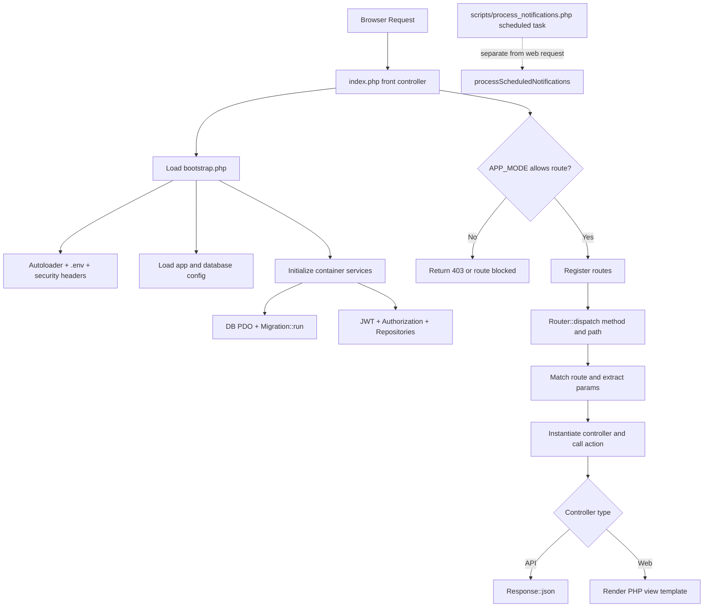
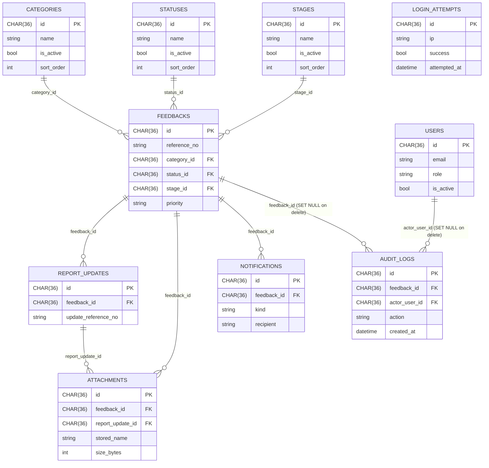
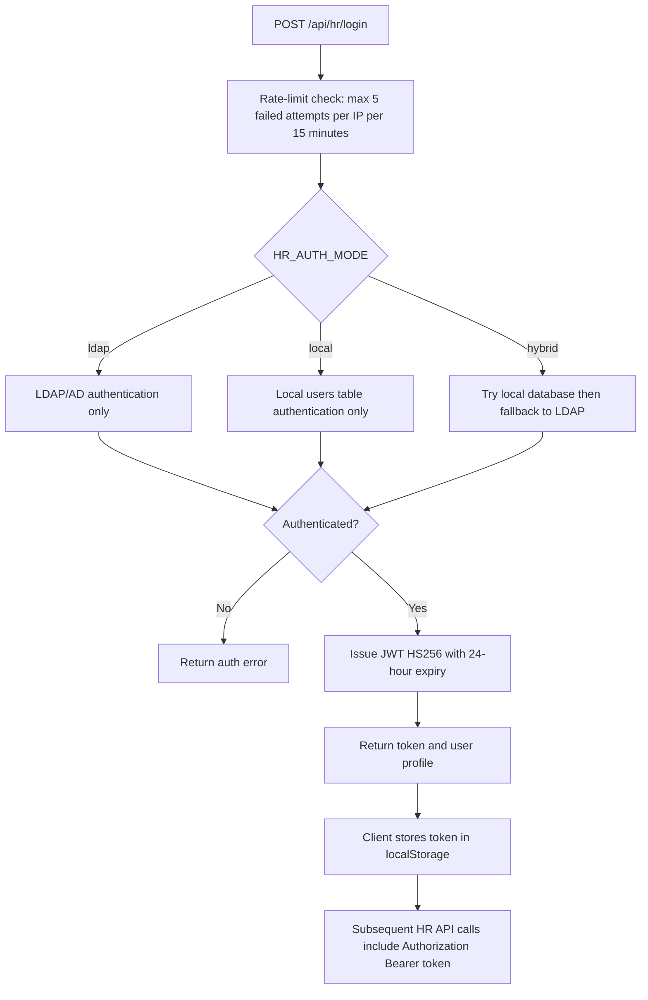

# Anonymous Feedback Tool — Technical Design Document

**Version:** 1.1  
**Date:** May 6, 2026  
**Status:** Updated

---

## 1. System Overview

The Anonymous Feedback Tool is a web application that enables employees to submit workplace concerns anonymously and allows HR staff to manage, investigate, and close those cases. The system is designed to operate in two deployment modes:

| Mode | Purpose |
|---|---|
| `public` | Internet-facing server — employee portal only (no HR console or HR APIs) |
| `full` | Intranet server — all features including HR console, HR APIs, dashboard, and admin management |

---

## 2. Technology Stack

| Layer | Technology |
|---|---|
| Language | PHP 8.1+ (strict types throughout) |
| Database | MySQL 8.0+ / MariaDB (InnoDB, utf8mb4) |
| Frontend | HTML5, Bootstrap 5, Vanilla JavaScript (ES6+) |
| Authentication | JWT (HS256, custom implementation — no external library) |
| LDAP / AD Integration | PHP `ldap_*` extension |
| Email | Custom SMTP mailer over PHP stream sockets — no external library |
| Web Server | Apache / Nginx with URL rewriting to `index.php` |
| CSS | Custom `app.css` built on Bootstrap |
| No framework | Custom MVC — no Composer, no third-party packages |

---

## 3. Application Architecture

The application follows a lightweight custom **MVC** pattern without any framework or package manager.

```
index.php                <-  Front controller: bootstraps, registers routes, dispatches
app/
  bootstrap.php          <-  Autoloader, .env loader, security headers, DI container setup
  Core/
    Router.php           <-  HTTP method + path matching, named parameter extraction
    Request.php          <-  Input abstraction (JSON body, POST, query string, method)
    Response.php         <-  JSON response helper
    Container.php        <-  Simple service locator / dependency injection container
    Database.php         <-  PDO factory — creates database if not exists, returns PDO
    Migration.php        <-  Idempotent schema migration runner (runs on every request)
    JwtService.php       <-  JWT encode/decode/verify (HS256, HMAC-SHA256)
    Authorization.php    <-  Bearer token extraction and role-based access
    SmtpMailer.php       <-  Native SMTP over stream sockets (STARTTLS + SMTPS)
  Controllers/
    Api/                 <-  Stateless JSON API controllers
    Web/                 <-  Page controllers (render HTML views)
  Models/                <-  Plain value objects with fromRow()/toArray()
  Repositories/          <-  All SQL queries, PDO interactions
  Services/              <-  Business logic (FeedbackService, NotificationService, LdapAuthService)
  Views/
    layouts/main.php     <-  Shared HTML shell, Bootstrap, navigation
    pages/               <-  Page-level PHP view templates
    emails/              <-  HTML email templates
config/
  app.php                <-  All application config (reads from environment variables)
  database.php           <-  Database connection config (reads from environment variables)
database/
  schema.sql             <-  Full DDL — CREATE TABLE IF NOT EXISTS for all tables
  users.sql              <-  Default HR user seed data and default category seed data
scripts/
  process_notifications.php   <-  CLI script run by cron for scheduled notifications
public/
  assets/css/app.css     <-  Stylesheet
  assets/js/app.js       <-  All frontend JavaScript
anonymous_feedback_private_uploads/ <- Private attachment storage (not web-accessible directly)
```

---

## 4. Request Lifecycle

### Flowchart



  ### Component Interaction (Detailed)

  ```mermaid
  sequenceDiagram
      participant Browser
      participant Front as index.php
      participant Boot as bootstrap.php
      participant Router
      participant Ctrl as Controller
      participant Svc as Service
      participant Repo as Repository
      participant DB as MySQL

      Browser->>Front: HTTP request
      Front->>Boot: require bootstrap.php
      Boot-->>Front: Container + Config + Security headers
      Front->>Front: APP_MODE / route guard checks
      Front->>Router: register routes + dispatch(method, path)
      Router->>Ctrl: call action(params)
      Ctrl->>Svc: business logic
      Svc->>Repo: persistence operations
      Repo->>DB: SQL query
      DB-->>Repo: rows/result
      Repo-->>Svc: mapped data
      Svc-->>Ctrl: response payload
      Ctrl-->>Browser: JSON or rendered HTML
  ```

---

## 5. Database Schema

### Entity Relationship Summary



### Table Definitions

#### `stages`
| Column | Type | Notes |
|---|---|---|
| id | CHAR(36) PK | UUID |
| name | VARCHAR(120) UNIQUE | Display name (e.g. Logged, Under Review, Escalated) |
| is_active | TINYINT(1) | 1 = available for use by HR |
| created_by_user_id | CHAR(36) NULL | FK -> users(id), ON DELETE SET NULL |
| updated_by_user_id | CHAR(36) NULL | FK -> users(id), ON DELETE SET NULL |
| sort_order | INT UNSIGNED | Controls display order |
| created_at | DATETIME | |
| updated_at | DATETIME | |

Default stages seeded on install: Logged, Under Review, Awaiting Response, Escalated, Resolved, Closed.

#### `categories`
| Column | Type | Notes |
|---|---|---|
| id | CHAR(36) PK | UUID |
| name | VARCHAR(120) UNIQUE | Display name |
| is_active | TINYINT(1) | 1 = shown to employees |
| created_by_user_id | CHAR(36) NULL | FK -> users(id), ON DELETE SET NULL |
| updated_by_user_id | CHAR(36) NULL | FK -> users(id), ON DELETE SET NULL |
| sort_order | INT UNSIGNED | Controls display order |
| created_at | DATETIME | |
| updated_at | DATETIME | |

#### `statuses`
| Column | Type | Notes |
|---|---|---|
| id | CHAR(36) PK | UUID |
| name | VARCHAR(120) UNIQUE | Display name |
| is_active | TINYINT(1) | 1 = usable by HR |
| created_by_user_id | CHAR(36) NULL | FK -> users(id), ON DELETE SET NULL |
| updated_by_user_id | CHAR(36) NULL | FK -> users(id), ON DELETE SET NULL |
| sort_order | INT UNSIGNED | Controls display order |
| created_at | DATETIME | |
| updated_at | DATETIME | |

#### `feedbacks`
| Column | Type | Notes |
|---|---|---|
| id | CHAR(36) PK | UUID |
| reference_no | VARCHAR(40) UNIQUE | Format: `AF-YYYYMMDD-XXXXXX` |
| category_id | CHAR(36) NOT NULL | FK  ->  categories(id) |
| category_other | VARCHAR(255) NULL | Populated only when category = "Other" |
| description | TEXT NOT NULL | Employee-submitted detail |
| status_id | CHAR(36) NOT NULL | FK  ->  statuses(id) |
| stage_id | CHAR(36) NOT NULL | FK  ->  stages(id) |
| assigned_to_user_id | CHAR(36) NULL | FK -> users(id), ON DELETE SET NULL |
| assigned_at | DATETIME NULL | Timestamp when assigned |
| updated_by_user_id | CHAR(36) NULL | FK -> users(id), ON DELETE SET NULL |
| priority | ENUM('Low','Normal','High','Critical') | Default: Normal — fixed ENUM (not a table) |
| anonymized_summary | TEXT NULL | HR-authored; visible to employee via lookup |
| action_taken | TEXT NULL | HR internal |
| outcome_comments | TEXT NULL | Required when status = "Investigation completed" |
| internal_notes | TEXT NULL | HR internal; never exposed to employee |
| acknowledged_at | DATETIME NULL | Timestamped on first HR acknowledgement |
| created_at | DATETIME NOT NULL | |
| updated_at | DATETIME NOT NULL | |

**Design note — Stage vs Priority:**
- `stage_id` is a FK to the `stages` table (like `status_id` and `category_id`) so HR can manage the set of defined workflow stages from the console.
- `priority` remains an ENUM (`Low`, `Normal`, `High`, `Critical`). These four values are semantically ordered and universally understood; storing them in a table would allow renaming that destroys that meaning.

#### `report_updates`
| Column | Type | Notes |
|---|---|---|
| id | CHAR(36) PK | UUID |
| feedback_id | CHAR(36) NOT NULL | FK  ->  feedbacks(id) ON DELETE CASCADE |
| update_reference_no | VARCHAR(40) UNIQUE | Format: `UPD-YYYYMMDD-XXXXXX` |
| update_text | TEXT NOT NULL | Employee follow-up content |
| created_at | DATETIME NOT NULL | |

#### `attachments`
| Column | Type | Notes |
|---|---|---|
| id | CHAR(36) PK | UUID |
| feedback_id | CHAR(36) NULL | FK  ->  feedbacks(id) ON DELETE CASCADE |
| report_update_id | CHAR(36) NULL | FK  ->  report_updates(id) ON DELETE CASCADE |
| original_name | VARCHAR(255) | Original filename |
| stored_name | VARCHAR(255) | Randomised filename on disk |
| mime_type | VARCHAR(150) | |
| size_bytes | INT UNSIGNED | |
| created_at | DATETIME NOT NULL | |

#### `audit_logs`
| Column | Type | Notes |
|---|---|---|
| id | CHAR(36) PK | UUID |
| feedback_id | CHAR(36) NULL | FK  ->  feedbacks(id) ON DELETE SET NULL |
| actor_user_id | CHAR(36) NULL | FK  ->  users(id) ON DELETE SET NULL (nullable for anonymous actions) |
| actor | VARCHAR(80) | `anonymous` or HR username |
| action | VARCHAR(200) | Machine-readable action label |
| reference_no | VARCHAR(40) | Retained even if report is deleted |
| details | TEXT | Human-readable detail |
| created_at | DATETIME NOT NULL | |

Design note:
- New FK naming uses `feedback_id` to align with the `feedbacks` table and avoid legacy ambiguity.

#### `notifications`
| Column | Type | Notes |
|---|---|---|
| id | CHAR(36) PK | UUID |
| feedback_id | CHAR(36) NOT NULL | FK  ->  feedbacks(id) ON DELETE CASCADE |
| kind | VARCHAR(20) | `new_feedback`, `followup_notif`, `reminder_48h`, `escalation_72h` |
| recipient | VARCHAR(100) | Email address sent to |
| sent_at | DATETIME NOT NULL | |

#### `users`
| Column | Type | Notes |
|---|---|---|
| id | CHAR(36) PK | UUID |
| name | VARCHAR(255) | |
| email | VARCHAR(255) UNIQUE | |
| password_hash | VARCHAR(255) | bcrypt |
| role | ENUM('hr','ethics','manager','officer') | |
| is_active | TINYINT(1) | |
| created_at / updated_at | DATETIME | |

#### `login_attempts`
| Column | Type | Notes |
|---|---|---|
| id | CHAR(36) PK | UUID |
| ip | VARCHAR(45) | IPv4 or IPv6 |
| success | TINYINT(1) | |
| attempted_at | DATETIME | |

---

## 6. API Endpoints

### Public Endpoints - External (`external/index.php`)

| Method | Path | Description |
|---|---|---|
| GET | `/` | Employee feedback portal (HTML) |
| POST | `/api/feedback` | Submit new anonymous feedback |
| POST | `/api/feedback/update` | Submit follow-up to existing case |
| GET | `/api/feedback/{reference}` | Retrieve own case status and updates |
| GET | `/api/attachments/{id}` | Download an attachment by ID |
| GET | `/api/categories` | List active categories (for dropdown) |
| GET | `/api/statuses` | List active statuses |

### Public/Mixed Endpoints - Internal (`internal/index.php`)

| Method | Path | Description |
|---|---|---|
| GET | `/` | Internal landing routed to HR shell |
| GET | `/api/reports` | Public anonymized reports (intranet/domain/VPN gated) |
| GET | `/api/attachments/{id}` | Download attachment by ID |
| GET | `/api/categories` | List active categories |
| GET | `/api/statuses` | List active statuses |
| GET | `/api/stages` | List active stages |
| GET | `/anonymized/reports` | Reports page (intranet/domain/VPN gated) |

### HR Endpoints (full mode only — JWT required except login)

| Method | Path | Description |
|---|---|---|
| GET | `/hr` | HR Management Console (HTML) |
| GET | `/hr/cases/{reference}` | Case update screen (HTML) |
| GET | `/hr/dashboard` | Analytics dashboard (HTML) |
| GET | `/hr/categories` | Manage categories (HTML) |
| GET | `/hr/statuses` | Manage statuses (HTML) |
| GET | `/hr/stages` | Manage stages (HTML) |
| POST | `/api/hr/login` | Authenticate HR user, returns JWT |
| POST | `/api/hr/logout` | Invalidate session |
| GET | `/api/hr/me` | Current authenticated user profile |
| GET | `/api/hr/cases` | List all feedback cases (filterable, paged) |
| GET | `/api/hr/cases/{reference}` | Full case detail |
| POST | `/api/hr/cases/{reference}` | Update case (status, priority, notes, etc.) |
| GET | `/api/hr/personnel` | List assignable HR/Ethics personnel |
| GET | `/api/hr/dashboard/trends` | Quarterly category trends + frequency summary |
| GET/POST/PUT/DELETE | `/api/hr/categories` | CRUD for feedback categories |
| GET/POST/PUT/DELETE | `/api/hr/statuses` | CRUD for workflow statuses |
| GET/POST/PUT/DELETE | `/api/hr/stages` | CRUD for workflow stages |

---

## 7. Authentication & Authorisation

### HR Login Flow



### LDAP Authentication Detail

The `LdapAuthService` supports two bind strategies:
1. **Service account bind** — Binds with a service account, searches the user DN in the subtree, then verifies credentials with a second bind as that user.
2. **Direct bind** — Attempts to bind directly using `LDAP_BIND_PATTERN` (e.g., `%s@domain.com`).

Role assignment from LDAP is determined by group membership (`LDAP_HR_GROUPS`, `LDAP_IS_GROUPS`), OU (`LDAP_HR_OUS`, `LDAP_IS_OUS`), or department (`LDAP_HR_DEPARTMENTS`, `LDAP_IS_DEPARTMENTS`).

TLS (`STARTTLS`) is supported and configured via `LDAP_USE_TLS=true`.

### JWT Verification

Every HR API controller calls `Authorization::authenticate()` which:
1. Extracts the `Bearer` token from the `Authorization` header
2. Verifies the HMAC-SHA256 signature using the configured `JWT_SECRET`
3. Checks the `exp` claim against the current time
4. Populates the `Authorization` service with the decoded user payload

---

## 8. Anonymity Mechanism

Anonymity is enforced at the application layer:

- No direct user identity is stored against anonymous submissions in `feedbacks`
- The `feedbacks` table has no user identifier column
- The only link back to a submission is the reference number, which is randomly generated (`bin2hex(random_bytes(3))`) and only shown once to the submitter
- `internal_notes` are never returned by any public API endpoint
- File downloads via `/api/attachments/{id}` serve by ID only — no path traversal is possible as `stored_name` is used with `basename()`

---

## 9. File Upload Handling

- Accepted MIME types are validated server-side (documents, images, audio, video, archives)
- Mixed-format multiple attachments are supported in a single submission
- Per-file size limit is 25MB
- Files are stored in a private attachments storage path (default: `anonymous_feedback_private_uploads/`) using a randomised `stored_name`
- The `/uploads/` path is blocked at the front controller level (HTTP 403) — files can only be downloaded via `/api/attachments/{id}`
- Attachment records are linked to either a `feedback_id` or a `report_update_id` (not both)

---

## 10. Email Notification System

### Immediate Notifications (triggered on submit)

| Event | Recipients |
|---|---|
| New feedback submitted | All active HR users (role = `hr`); falls back to `HR_NOTIFICATION_EMAIL` env var |
| Employee follow-up submitted | All active HR users |

### Scheduled Notifications (triggered by cron / Task Scheduler)

The script `scripts/process_notifications.php` must be run by an external scheduler (Linux cron or Windows Task Scheduler — recommended: every hour). It is **not** called on web requests. It identifies reports that:
- Have not been acknowledged after a configurable number of hours
- Have not already received a notification of that `kind` (deduplication via `notifications` table)

| Threshold | Kind | Recipients |
|---|---|---|
| 48 hours unacknowledged | `reminder_48h` | HR users (role = `hr`) |
| 72 hours unacknowledged | `escalation_72h` | Ethics users (role = `ethics`) |

**Dev override:** Set `DEV_NOTIFICATION_EMAIL` in `.env` to redirect all notification emails to a single address during development.

### Email Transport

`SmtpMailer` uses native PHP `stream_socket_client()` — no external libraries. It supports:
- **STARTTLS** — port 587 (negotiated upgrade)
- **SMTPS** — port 465 (implicit SSL)
- Multipart MIME messages with HTML + plain-text fallback

---

## 11. Security Controls

| Control | Implementation |
|---|---|
| SQL Injection | All queries use PDO prepared statements with bound parameters |
| XSS | Output in views uses `htmlspecialchars()` / `escHtml()` in JS; CSP not yet implemented |
| CSRF | Public anonymous endpoints exist; HR state-changing operations require JWT |
| Clickjacking | `X-Frame-Options: DENY` header set on all responses |
| MIME sniffing | `X-Content-Type-Options: nosniff` header |
| Path traversal | Attachment downloads use `basename()` on stored filename; uploads directory blocked at front controller |
| Brute force | `login_attempts` table tracks per-IP failures; lockout after 5 failures in 15 minutes |
| JWT secret | Must be set via `JWT_SECRET` environment variable; application warns if default value is used |
| Direct uploads access | `str_starts_with(path, '/uploads')` check in `index.php` returns HTTP 403 |
| LDAP injection | Credentials passed directly to `ldap_bind()` — not used in LDAP search filter strings |

---

## 12. Environment Configuration

All configuration is driven by environment variables loaded from a `.env` file. No credentials are stored in source code.

| Variable | Description | Default |
|---|---|---|
| `APP_NAME` | Application display name | `Anonymous Feedback Tool` |
| `APP_MODE` | `public` or `full` | `full` |
| `APP_BASE_URL` | Base URL (required for cron email links) | `http://localhost:8000` |
| `ATTACHMENTS_STORAGE_PATH` | Absolute/relative private attachments directory | repo `anonymous_feedback_private_uploads` |
| `JWT_SECRET` | HMAC signing key — **must be changed in production** | insecure default |
| `DB_HOST` | MySQL host | `127.0.0.1` |
| `DB_PORT` | MySQL port | `3306` |
| `DB_DATABASE` | Database name | `anonymous_feedback_tool` |
| `DB_USERNAME` | Database user | _(empty)_ |
| `DB_PASSWORD` | Database password | _(empty)_ |
| `HR_AUTH_MODE` | `hybrid`, `ldap`, or `local` | `hybrid` |
| `LDAP_HOST` | Active Directory / LDAP server | `localhost` |
| `LDAP_PORT` | LDAP port | `389` |
| `LDAP_BASE_DN` | Base DN for user searches | _(empty)_ |
| `LDAP_DOMAIN` | AD domain for UPN suffix | _(empty)_ |
| `LDAP_BIND_PATTERN` | Direct-bind pattern (e.g. `%s@domain.com`) | `%s` |
| `LDAP_USE_TLS` | Enable STARTTLS | `false` |
| `LDAP_SERVICE_USER` | Service account DN for bind | _(empty)_ |
| `LDAP_SERVICE_PASSWORD` | Service account password | _(empty)_ |
| `LDAP_HR_GROUPS` | Pipe-separated HR group DNs/CNs | _(empty)_ |
| `LDAP_IS_GROUPS` | Pipe-separated Information Systems group DNs/CNs | _(empty)_ |
| `LDAP_HR_OUS` | Pipe-separated OU fragments for HR role mapping | _(empty)_ |
| `LDAP_IS_OUS` | Pipe-separated OU fragments for Information Systems role mapping | _(empty)_ |
| `LDAP_HR_DEPARTMENTS` | Pipe-separated department names for HR role mapping | _(empty)_ |
| `LDAP_IS_DEPARTMENTS` | Pipe-separated department names for Information Systems role mapping | _(empty)_ |
| `DEVELOPER_OVERRIDE_USERS` | Pipe-separated developer override account identifiers | _(empty)_ |
| `SMTP_HOST` | SMTP server hostname | `localhost` |
| `SMTP_PORT` | SMTP port (587 = STARTTLS, 465 = SMTPS) | `587` |
| `SMTP_USERNAME` | SMTP auth username | _(empty)_ |
| `SMTP_PASSWORD` | SMTP auth password | _(empty)_ |
| `MAIL_FROM` | Sender email address | `noreply@localhost` |
| `MAIL_FROM_NAME` | Sender display name | `Voice Without Fear` |
| `HR_NOTIFICATION_EMAIL` | Fallback HR notification recipient | _(empty)_ |
| `ETHICS_NOTIFICATION_EMAIL` | Ethics officer notification recipient | _(empty)_ |
| `NOTIFICATIONS_IMMEDIATE_ENABLED` | Enable immediate notifications | `true` |
| `NOTIFICATIONS_SCHEDULED_ENABLED` | Enable scheduler-driven notifications | `true` |
| `DEV_NOTIFICATION_EMAIL` | **Dev only** — when set, all notifications are redirected to this address regardless of DB recipients | _(empty)_ |
| `MALWARE_SCANNER` | Malware scanner mode (`noop` or `clamav`) | `noop` |

---

## 13. Database Migration Strategy

`Migration::run(PDO $pdo)` is called on **every request** from `bootstrap.php`. All DDL statements use `IF NOT EXISTS` and are wrapped in `try/catch` blocks so they are idempotent — running them on an already-migrated database has no effect.

The migration handles both:
- **Fresh installs** — creates all tables from `schema.sql` and seeds default data from `users.sql`
- **Legacy upgrades** — detects and migrates old schema versions:
  - `status` (text column)  ->  `status_id` (FK to `statuses` table)
  - `category` (text column)  ->  `category_id` (FK to `categories` table) + `category_other`
  - `audit_logs.feedback_id` FK addition

---

## 14. Frontend Architecture

All frontend logic is in a single file: `public/assets/js/app.js`.

The page is a **Single HTML Shell** — `layouts/main.php` loads once and `app.js` calls the REST API to populate all dynamic content without full page reloads.

Key patterns used:
- `api(url, options)` — central `fetch` wrapper that automatically attaches the JWT `Authorization` header if a token is present in `localStorage`
- `TokenManager` — localStorage-based JWT read/write/clear helper
- `escHtml(str)` — client-side HTML escaping to prevent XSS from API data rendered into the DOM
- All form submissions are intercepted with `addEventListener('submit', ...)` — no native form posts
- The "Other" category selection dynamically shows/hides a free-text field without a page reload

---

## 15. Deployment Topology (Recommended)

```
Internet
    │
    ▼
[Public Server]  APP_MODE=public
  ├── Employee submission portal  (/)
  ├── Public feedback API         (/api/feedback/*, /api/categories, /api/statuses)
  └── No HR routes registered

    (Internal network only)
    │
    ▼
[Intranet Server]  APP_MODE=full
  ├── HR Management Console       (/hr/*)
  ├── HR API (JWT protected)      (/api/hr/*)
  └── Shares same MySQL database as public server

[MySQL Server]
  └── anonymous_feedback_tool database

[Cron Job — Intranet Server]
  └── php scripts/process_notifications.php  (every 30–60 minutes)
```

Both servers share the same codebase and the same database. The `APP_MODE` environment variable controls which routes are registered.

---

## 16. Reference Number Format

| Prefix | Format | Example | Used For |
|---|---|---|---|
| `AF` | `AF-YYYYMMDD-XXXXXX` | `AF-20260428-3F9A12` | New feedback reports |
| `UPD` | `UPD-YYYYMMDD-XXXXXX` | `UPD-20260428-B8C441` | Follow-up updates |

The six-character suffix is generated using `strtoupper(bin2hex(random_bytes(3)))` — 16.7 million possible values per day, collision probability negligible for typical usage volumes.
